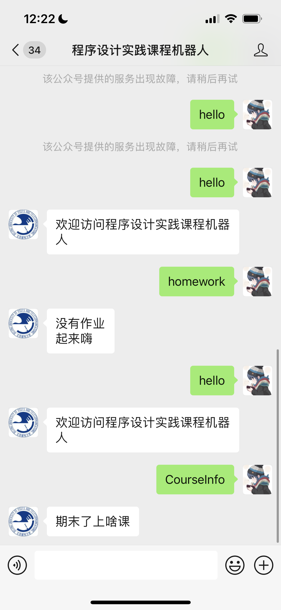

# 程序设计实践作业

## 运行截图



## 解析器

框架：pyparsing
交互框架：fastapi(处理http请求) + nginx(非root用户端口转发)

## 配置

nginx:
(转发微信公众号的post请求)
```
server {
    listen       80;
    server_name  localhost;

    location / {
            proxy_pass http://127.0.0.1:8000;
    }
}
```

## example

```
step Proc:welcome
PRINT hello
BRANCH homework Proc:hw
BRANCH CourseInfo Proc:CourseInfo
end step
step Proc:hw
WAIT 5
BRANCH homework Proc:hw
BRANCH CourseInfo Proc:CourseInfo
end step
```

```
BNF:

instruction := step*

step        := begin detail* end

begin       := "step" stepname

stepname    := "Proc:" + name(only alphnum)

detail = branch_detail | wait_detail | print_detail | default_detail | goto_detail

end         := "end step"
```